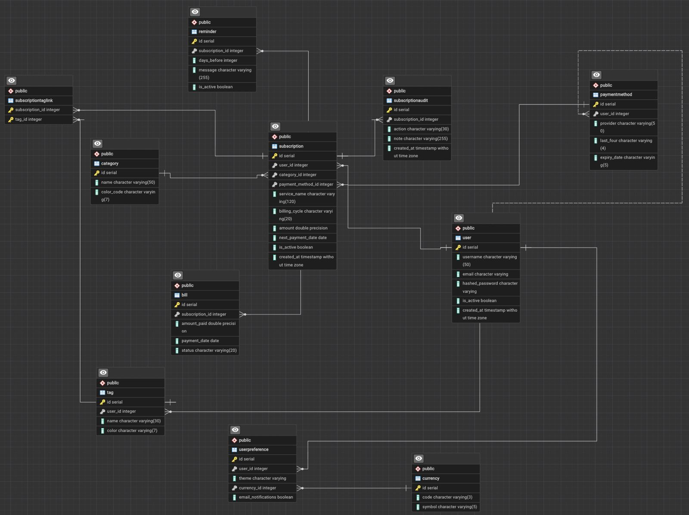

# SWE314 Web Programming - TinyVault Subscription Tracker (Full Stack)

**Instructor:** Asst. Prof. Yigit Bekir Kaya  
**Course:** SWE314 - Web Programming, Istinye University

## Overview

**TinyVault** is a full-stack subscription tracker that helps users manage recurring digital payments (Netflix, Spotify, Notion, Google Drive, etc.) in one place.

Business pain points addressed:
- Users forget active subscriptions
- Renewal dates are missed
- Monthly spending is unclear and uncontrolled
- Currency differences make multi-service tracking hard

## Screenshots

### Database ER Diagram (PostgreSQL — pgAdmin)



### App


### API & Test Evidence


## Repository Structure

```text
SubTrack/
├── tinyvault-api/            # FastAPI backend (REST API + PostgreSQL)
│   ├── main.py               # Route handlers + security middleware
│   ├── models.py             # 11 SQLModel entities with M:N relationships
│   ├── services.py           # Business logic layer
│   ├── schemas.py            # Pydantic request/response DTOs
│   ├── database.py           # PostgreSQL engine configuration
│   └── requirements.txt      # Python dependencies
├── v1/tinyvault-frontend/    # Session 1: Basic React frontend
├── v2/tinyvault-frontend/    # Session 2: Full-featured React frontend
├── chrome-extension/         # Mini-Vault Chrome companion extension
├── screenshots/              # App screenshots for documentation
├── prompts/                  # AI prompts used per session
├── REPORT.md                 # Technical midterm report
├── TEST_CASES.md             # Manual test scenarios
└── responsibilities/         # Team responsibility breakdown
```

## Sessions

### Session 1 (`v1/`) - Read and Visualize Foundation

- Fetch subscriptions from backend API
- Display cards in responsive layout
- Show computed fields (monthly estimate, upcoming payment)
- Handle loading and error states

### Session 2 (`v2/`) - Interactive Full-Stack Flows with Advanced Architecture

- Add new subscription form (POST) with tag support (M:N relation demo)
- Remove subscription action (DELETE) with cascade
- Search and category filtering (via relational `Category` entity)
- Server-side sorting controls
- Summary cards (active count, monthly total, due in 7 days, converted total)
- Category spend pie chart (`recharts`)
- Detail modal with inline edit/update (PUT)
- Pause/Resume subscription via `is_active` toggle
- Audit history in modal (1:N `SubscriptionAudit` relation)
- Calendar export button (`.ics` file generation)
- Toast notifications (`react-hot-toast`)
- UI animations (`gsap` + `@gsap/react`)
- Tag badges on subscription cards (M:N `Tag` relation)

## Data Model — 11 Entities with Advanced Relationships

| Entity | Role | Relation |
|--------|------|----------|
| `User` | System user for auth | Root entity |
| `UserPreference` | User settings (theme, currency) | **1:1** with User |
| `Currency` | Supported currency lookup | 1:N with UserPreference |
| `Category` | Subscription categories | **1:N** with Subscription |
| `PaymentMethod` | Credit cards / payment providers | **1:N** with Subscription |
| `Tag` | Custom user-defined labels | **M:N** with Subscription |
| `SubscriptionTagLink` | M:N junction table | Links Tag ↔ Subscription |
| `Subscription` | Core entity | Central hub |
| `SubscriptionAudit` | Change history log | **1:N** with Subscription |
| `Bill` | Historical payment records | **1:N** with Subscription |
| `Reminder` | Upcoming payment alerts | **1:N** with Subscription |

## Backend Highlights (`tinyvault-api/`)

- **FastAPI + SQLModel + PostgreSQL** architecture
- **11 distinct entities** with 1:1, 1:N, and M:N relationships
- Thin route handlers delegating to a `SubscriptionService` class
- **Rate Limiting:** `slowapi` enforces 60 requests/minute per IP (DDoS protection)
- **CORS Policy:** Restricted to `localhost:5173` and Chrome extension origins
- **Global Exception Handlers:** Clean JSON errors, no stack trace leakage
- **Pydantic validation** on all request payloads (min/max length, ge=0, Literal types)
- Mock JWT authentication via `Depends` injection pattern
- External FX API integration with timeout and 502/503 error handling
- Cascade delete on all child entities

## Quick Start

### Prerequisites
- PostgreSQL 16 running locally (`brew services start postgresql@16`)
- Database created: `createdb tinyvault`

### 1) Start Backend

```bash
cd tinyvault-api
python3 -m venv venv
source venv/bin/activate
pip install -r requirements.txt
uvicorn main:app --reload
```

Backend URL: `http://127.0.0.1:8000`  
Swagger docs: `http://127.0.0.1:8000/docs`

> **Auth note:** Use query param `token=fake-jwt-token-123` in Swagger to authorize endpoints.

### 2) Start Frontend v2

```bash
cd v2/tinyvault-frontend
npm install
npm run dev
```

Frontend URL: `http://127.0.0.1:5173`

## API Endpoints

| Method | Endpoint | Description |
|--------|----------|-------------|
| GET | `/` | Health / welcome |
| GET | `/subscriptions` | List subscriptions (filter + sort + pagination) |
| GET | `/subscriptions/summary/monthly-total` | Aggregated summary metrics |
| GET | `/subscriptions/summary/converted?currency=USD\|TRY\|EUR` | Converted summary using external FX rate |
| GET | `/subscriptions/{subscription_id}` | Get one subscription |
| GET | `/subscriptions/{subscription_id}/audits` | Get audit history |
| GET | `/subscriptions/{subscription_id}/calendar` | Download `.ics` calendar reminder |
| POST | `/subscriptions` | Create subscription (with tags) |
| PUT | `/subscriptions/{subscription_id}` | Update subscription |
| DELETE | `/subscriptions/{subscription_id}` | Delete subscription (cascades) |

## Tech Stack

| Layer | Technology |
|-------|-----------|
| Frontend | React 18, Vite, CSS (Glassmorphism) |
| Frontend Libraries | GSAP, @gsap/react, Recharts, react-hot-toast |
| Backend | Python, FastAPI, SQLModel |
| Database | **PostgreSQL 16** (via psycopg2-binary) |
| Security | slowapi (rate limiting), restricted CORS, global error handlers |
| External Integration | Frankfurter FX API via `httpx` (async, timeout-safe) |
| Browser Extension | Chrome Extension (Manifest V3) |
