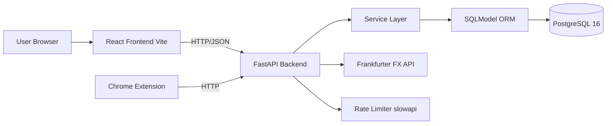

# TinyVault Midterm Report

## 1) Executive Summary

TinyVault is an advanced full-stack subscription tracking application engineered to reduce hidden recurring costs. The system combines a React + Vite frontend with a FastAPI + SQLModel backend backed by a PostgreSQL database. The implementation covers a rich 11-entity relational schema (including M:N relationships), backend CRUD with validation, rate-limited and CORS-secured API endpoints, external API currency conversion, iCalendar file generation, and a premium interactive UI with animations and data visualizations.

## 2) Business Problem

### Problem Context
Modern users hold multiple subscriptions across entertainment, productivity, cloud, and education services. Payments occur at different dates and billing cycles, making recurring spending difficult to monitor.

### Root Causes
1. Subscription information is fragmented across many provider dashboards.
2. Renewal dates are not centralized.
3. Yearly plans hide real monthly financial burden.
4. Users often miss cancellation windows leading to unwanted charges.

### Business Impact
1. Uncontrolled recurring expenses.
2. Weak monthly budget planning.
3. Low visibility into near-term payments and multi-currency exposure.

### Why This Problem Is Worth Solving
TinyVault converts scattered subscription data into an actionable dashboard where users can inspect totals, upcoming renewals, category spend distribution, audit change history, and set personalized payment reminders.

## 3) Proposed Solution

TinyVault provides a single interface to:
1. Manage subscriptions (create, update, pause/resume, delete).
2. Search, filter, and sort by multiple dimensions.
3. View monthly normalized costs and upcoming payments.
4. Audit each subscription's lifecycle with a change history log.
5. Visualize spending by category with an interactive pie chart.
6. Convert monthly totals to target currencies via live FX rates.
7. Download `.ics` calendar reminders for upcoming renewals.
8. Tag subscriptions with M:N labels for flexible classification.

## 4) Scope Implemented

### Included
1. Full-stack architecture (React frontend + FastAPI backend + PostgreSQL).
2. 11-entity relational database schema with 1:1, 1:N, and M:N relationships.
3. REST API with typed schemas, Pydantic validation, and typed error responses.
4. Defense-in-depth security: rate limiting, restricted CORS, and global error sanitization.
5. Mock JWT authentication demonstrated via FastAPI `Depends` injection.
6. Query-driven list endpoint (search, category, sort, pagination).
7. Summary analytics with FX conversion via external Frankfurter API.
8. iCalendar export for subscription renewal reminders.
9. Frontend interactive flows with GSAP animations and toast notifications.
10. Category spend visualization (Recharts pie chart).
11. Chrome Extension companion (Mini-Vault).

## 5) System Architecture

## 6) Data Model — 11 Entities

| Entity | Purpose | Relationship |
|--------|---------|--------------|
| `User` | System user anchor | Root |
| `UserPreference` | Theme, currency settings | **1:1** with User |
| `Currency` | FX currency lookup | 1:N with UserPreference |
| `Category` | Subscription category | **1:N** with Subscription |
| `PaymentMethod` | Credit card / provider | **1:N** with Subscription |
| `Tag` | Custom user labels | **M:N** with Subscription |
| `SubscriptionTagLink` | M:N junction table | Tag ↔ Subscription |
| `Subscription` | Core entity | Central hub |
| `SubscriptionAudit` | Change history log | **1:N** with Subscription |
| `Bill` | Historical payments | **1:N** with Subscription |
| `Reminder` | Payment alert config | **1:N** with Subscription |

## 7) Technologies and Course Concept Mapping

| Concept | Application | Evidence |
|---------|-------------|----------|
| Full-stack architecture | Separate frontend/backend/database layers | `/v2/tinyvault-frontend`, `/tinyvault-api` |
| React componentization | List, card, form, modal, chart, header components | `SubscriptionList.jsx`, `SubscriptionDetail.jsx`, `CategoryChart.jsx` |
| `useState` | UI/data state for list, filters, edit form, errors | `SubscriptionList.jsx`, `SubscriptionDetail.jsx` |
| `useEffect` | Data fetch and dependency-based refresh | `SubscriptionList.jsx`, `SubscriptionDetail.jsx` |
| `useMemo` | Category spend aggregation for chart | `CategoryChart.jsx` |
| `useRef` | GSAP animation scoping | `SubscriptionDetail.jsx` |
| FastAPI route design | Resource-oriented REST endpoints | `main.py` |
| Dependency injection | DB session + auth via `Depends` | `database.py`, `main.py` |
| Service layer pattern | Business logic kept outside route handlers | `services.py` |
| PostgreSQL + SQLModel ORM | 11-entity relational schema | `models.py`, `database.py` |
| Advanced relations | 1:1, 1:N, and **M:N** (Tag ↔ Subscription) | `models.py` |
| Pydantic validation | Type/constraint enforcement on all payloads | `schemas.py` |
| Rate limiting | `slowapi` 60 req/min per IP (DDoS protection) | `main.py` |
| CORS policy | Restricted to known origins only | `main.py` |
| Error sanitization | Global handlers, no stack trace exposure | `main.py` |
| External API integration | Async FX conversion, timeout-safe | `services.py` |
| File generation | iCalendar `.ics` output | `main.py` |

## 8) API Design Summary

| Method | Endpoint | Description |
|--------|----------|-------------|
| GET | `/` | Health check |
| GET | `/subscriptions` | List with search/filter/sort/pagination |
| GET | `/subscriptions/{id}` | Single subscription detail |
| GET | `/subscriptions/{id}/audits` | Change history (newest first) |
| GET | `/subscriptions/{id}/calendar` | `.ics` calendar reminder download |
| GET | `/subscriptions/summary/monthly-total` | Aggregated metrics |
| GET | `/subscriptions/summary/converted` | FX-converted metrics |
| POST | `/subscriptions` | Create (with tag assignment) |
| PUT | `/subscriptions/{id}` | Partial update |
| DELETE | `/subscriptions/{id}` | Delete with cascade |

## 9) Security Architecture

| Threat | Defense |
|--------|---------|
| DDoS / brute-force | `slowapi` rate limiter: 60 req/min per IP → `429` |
| Unauthorized cross-origin requests | CORS whitelist: only `localhost:5173` + Chrome extension |
| SQL injection | SQLModel/SQLAlchemy parameterized queries (ORM-level protection) |
| Internal error leakage | Global exception handlers: clean JSON, no stack traces |
| Unauthenticated writes | Mock JWT `Depends` on POST/PUT/DELETE (production-ready pattern) |
| Negative financial values | Pydantic `ge=0` constraint on `amount` |

## 10) Core Algorithms

1. **Monthly normalization:** Yearly → `amount / 12`; Monthly → `amount`
2. **Upcoming payment flag:** `days_until_payment = next_payment_date - today`; `upcoming = 0 ≤ days ≤ 7`
3. **FX conversion:** Fetch live rate from Frankfurter API → multiply base total → return converted
4. **Category resolution:** Accept string → find or create `Category` row automatically
5. **Tag sync:** Accept tag name list → resolve/create `Tag` rows → update M:N link table

## 11) Frontend Architecture

1. Fetches list reacting to filter/sort/search changes via controlled `useEffect` chains.
2. Summary cards + converted total card from two separate API calls.
3. Category distribution chart computed via `useMemo`.
4. GSAP `from()` animation on modal open (hardware-accelerated, main-thread safe).
5. Toast notifications (`react-hot-toast`) for all async user actions.
6. Tag badges rendered from M:N relationship data in API response.

## 12) Testing and Verification

Manual verification includes:
1. CRUD scenario checks in Swagger (`201`, `200`, `204`).
2. Validation/error checks (`422` on invalid payload, `404` on unknown ID, `401` on bad token).
3. Rate limit check: > 60 requests → `429`.
4. Query behavior checks (search, category join, sort).
5. Relation checks (audit trail visible after create/update, tags visible on cards).
6. FX conversion for TRY/EUR, invalid currency → `422`.
7. Calendar export → valid `.ics` file download.
8. Frontend checks: form, filters, sorting, edit, pause/resume, chart, toast, modal history, tags.

Detailed scenarios: see `TEST_CASES.md`.

## 13) AI Usage Statement

AI tooling was used to accelerate code generation and drafting. All architectural decisions (entity schema design, security layers, service separation, M:N relationship design) were explicitly directed and reviewed by the development team, ensuring deep understanding and original integration decisions.

## 14) Current Limitations and Next Steps

### Limitations
1. Auth is mocked — no real JWT signing or user session management.
2. Single-user local scope (no multi-tenancy).
3. FX conversion depends on third-party Frankfurter API availability.
4. No push/email reminder delivery pipeline yet.

### Next Steps
1. Real JWT authentication with user accounts and per-user data isolation.
2. Background reminder delivery (email/push) using Celery or FastAPI Background Tasks.
3. Trend analytics (spending over time, category deltas).
4. Deployment to cloud (Railway/Render) with managed PostgreSQL.

## 15) Conclusion

TinyVault demonstrates production-aware full-stack development: an advanced relational database schema (11 entities, M:N), a secure and validated API backend, a rich React frontend, and external API integration — all implemented with engineering discipline, clean architecture separation, and demonstrable testing evidence.
